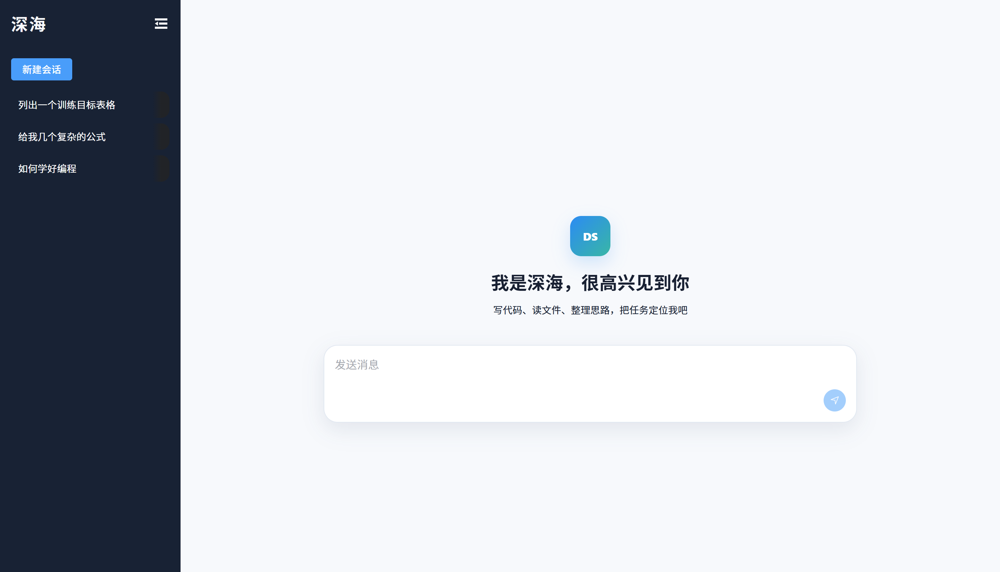
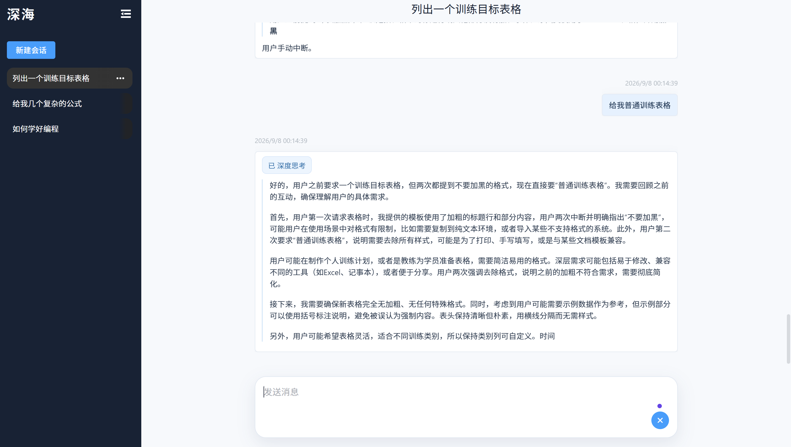
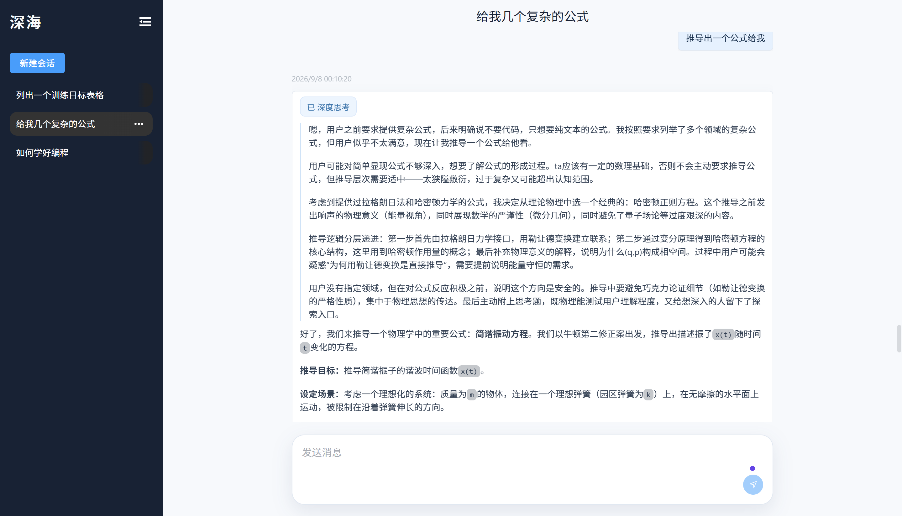
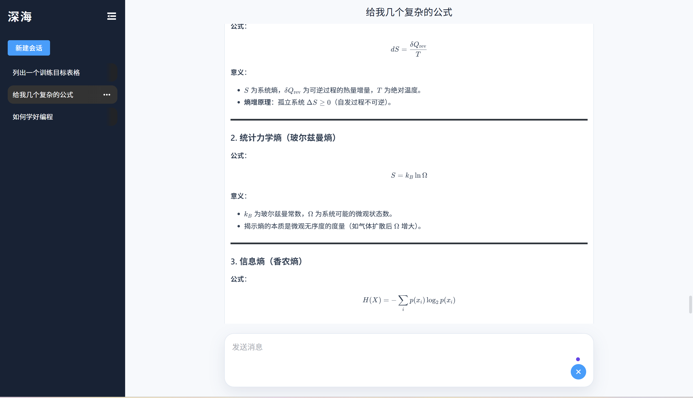
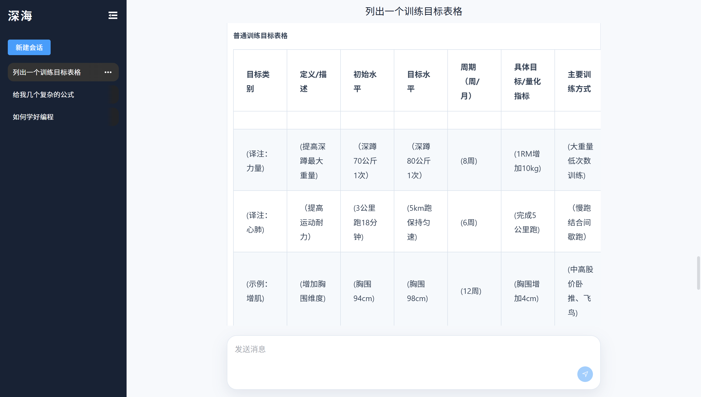

# vue-deepseek-chat

基于 Vue 3、TypeScript、Vite、Element Plus 和 UnoCSS 构建的 深海 简易对话应用。



## 功能

- 支持多轮对话
- 支持 SSE 流式输出与手动中断
- 回复过程中自动滚动，并在末尾显示生成光标
- 支持 Markdown、数学公式、代码高亮和代码复制
- 支持 DeepSeek 推理内容展示
- 会话历史保存在浏览器本地存储

## 本地运行

```bash
pnpm install
pnpm dev
```

## 配置

在 `.env` 中配置 DashScope API 地址和密钥：

```bash
VITE_APP_API_BASE_URL=https://dashscope.aliyuncs.com
VITE_APP_API_KEY=sk-************************
```

## 演示

## 演示

### 1. 多轮对话与训练目标表格生成



### 2. DeepSeek 深度思考与复杂公式生成



### 3. Markdown、代码高亮与数学公式



### 4. 会话历史管理


